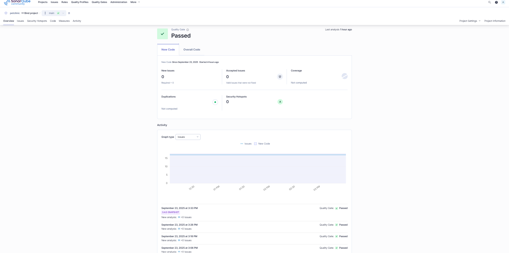
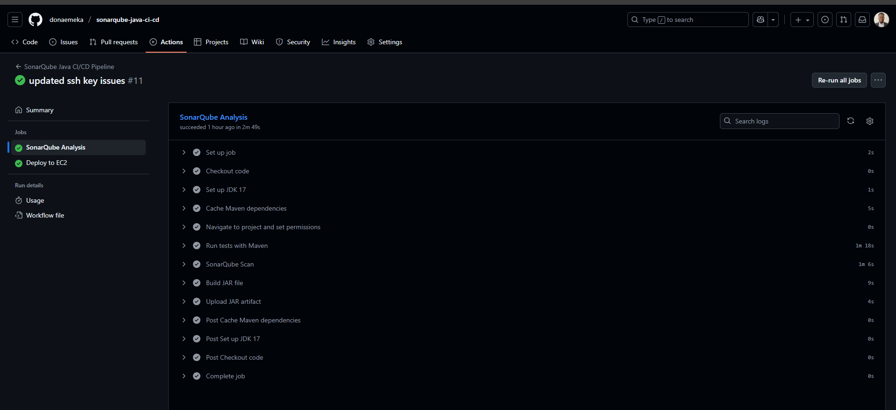
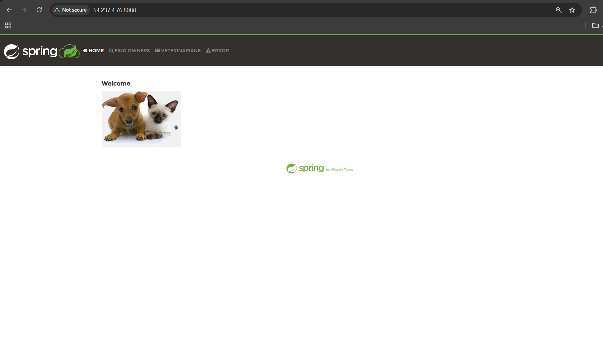

## SonarQube Java CI/CD Pipeline with Spring PetClinic - DevOps

## Project Overview

Welcome to my **Spring PetClinic project**, This project demonstrates an end-to-end Java CI/CD pipeline for the popular Spring PetClinic application. It integrates SonarQube for code quality, GitHub Actions for automation, and AWS EC2 for deployment, showcasing real-world DevOps practices.

## Key Features

1.  **CI/CD Pipeline:**    Fully automated build, test, SonarQube scan, artifact packaging, and deployment

2.  **Code Quality:**    Detects bugs, code smells, and security issues with SonarQube

3.  **Deployment:**    Runs the Spring Boot app as a service on EC2.

4.  **Modern Tech Stack:**    Java 17, Spring Boot, Maven, GitHub Actions, AWS EC2

## ⚡ Pipeline Flow

- **Checkout Code** → Pull from GitHub repository

- **Build & Test** → Maven builds and runs unit tests

- **SonarQube Analysis** → Scans for code quality and vulnerabilities

- **Artifact Upload** → Package JAR and upload to GitHub artifacts

- **Deploy to EC2**→ Automatically transfer and run the JAR on the server

## 🛠️ Technologies Used

- **Language & Framework:** Java 17, Spring Boot

- **Build Tool:** Maven

- **CI/CD: GitHub** Actions

- **Code Quality:** SonarQube

- **Cloud Deployment:** AWS EC2

- **Monitoring:** Application logs captured in app.log

## 📊 Pipeline Success Metrics

### ✅ SonarQube Analysis Results

*Code quality metrics and quality gate status*

### ✅ GitHub Actions Pipeline  

*Successful CI/CD pipeline execution*

### ✅ Application Deployment

*Application successfully deployed on AWS EC2*

## How to Run

1.  Clone the repository:

       ## git clone https://github.com/donaemeka/Spring-PetClinic-SonarQube-Project.git

       ## cd Spring-PetClinic-SonarQube-Project/spring-petclinic

2.  Set up your environment variables in GitHub secrets:

    - **SONAR_TOKEN** → SonarQube token

    - **SONAR_HOST_URL** → SonarQube server URL

    - **EC2_SSH_KEY** → Private SSH key for EC2

    - **EC2_HOST** → Public IP of your EC2 instance

3.  Push changes to the main branch – GitHub Actions will automatically run the CI/CD pipeline

4. Access deployed app on your EC2 instance at port 8080

## Key Learnings & Skills Demonstrated

- Designing CI/CD pipelines for Java applications

- Implementing automated code quality analysis with SonarQube

- Managing Maven builds and dependency caching

- Deploying Spring Boot applications to cloud servers

- Securing CI/CD secrets and automating SSH-based deployment

- Understanding real-world DevOps workflows for microservices

## Why This Project Is Valuable:

This project showcases a complete DevOps lifecycle:  from **development** → **testing**→ **quality assurance** → **deployment.** It is an excellent example of how automation, quality, and cloud deployment come together, making it highly relevant for DevOps Engineer, Site Reliability Engineer, or Cloud Engineer roles.

This implementation demonstrates my capability to design production-ready DevOps pipelines with automated quality gates and cloud deployments.

## 👨‍💻 About Me

**Donatus Emeka Anyalebechi**  

*DevOps Engineer | AWS Certified | CI/CD Specialist*

## Open to new opportunities in DevOps and Cloud Engineering roles*

### 🔧 Technical Expertise

- **Cloud & Infrastructure**: AWS EC2, Docker, Linux, SSH

- **CI/CD & Automation**: GitHub Actions, SonarQube, Maven

- **Development**: Java, Spring Boot, Microservices

- **Monitoring & Quality**: SonarQube analysis, log monitoring

### 📞 Contact

- **GitHub**: github.com/donaemeka

- **LinkedIn**: linkedin.com/in/donatus-devops

- **Email**: donaemeka92@gmail.com

