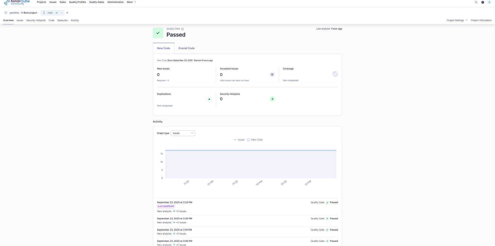
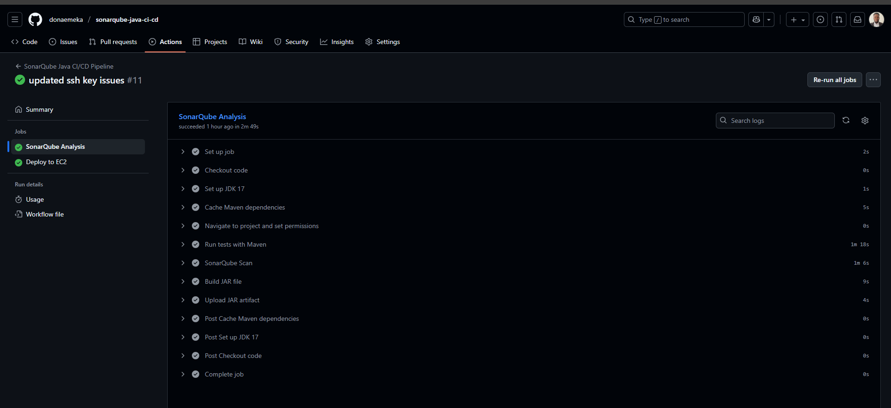
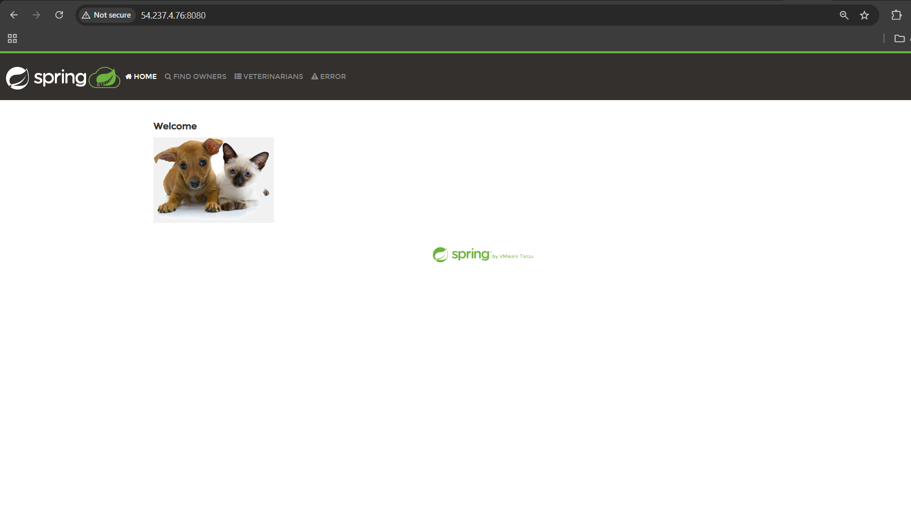

## SonarQube Java CI/CD Pipeline with Spring PetClinic

## Project Overview

Welcome to my **Spring PetClinic project**, This project demonstrates an end-to-end Java CI/CD pipeline for the popular Spring PetClinic

application. It integrates SonarQube for code quality, GitHub Actions for automation, and AWS EC2 for deployment, showcasing real-world DevOps 
 
practices.

## Key Features

1. **CI/CD Pipeline:** Fully automated build, test, SonarQube scan, artifact packaging, and deployment

2. **Code Quality:** Detects bugs, code smells, and security issues with SonarQube

3. **Deployment:** Runs the Spring Boot app as a service on EC2.

4. **Modern Tech Stack:** Java 17, Spring Boot, Maven, GitHub Actions, AWS EC2

## ⚡ Pipeline Flow

- **Checkout Code** → Pull from GitHub repository

- **Build & Test** → Maven builds and runs unit tests

- **SonarQube Analysis** → Scans for code quality and vulnerabilities

- **Artifact Upload** → Package JAR and upload to GitHub artifacts

- **Deploy to EC2**→ Automatically transfer and run the JAR on the server

## 🛠️ Technologies Used

- **Language & Framework:** Java 17, Spring Boot

- **Build Tool:** Maven

- **CI/CD: GitHub** Actions

- **Code Quality:** SonarQube

- **Cloud Deployment:** AWS EC2

- **Monitoring:** Application logs captured in app.log

## 📊 Pipeline Success Metrics

### ✅ SonarQube Analysis Results

*Code quality metrics and quality gate status*

### ✅ GitHub Actions Pipeline  

*Successful CI/CD pipeline execution*

### ✅ Application Deployment

*Application successfully deployed on AWS EC2*

## How to Run

1. Clone the repository:

       ## git clone https://github.com/donaemeka/sonarqube-java-ci-cd.git

       ## cd sonarqube-java-ci-cd/spring-petclinic

2. Set up your environment variables in GitHub secrets:

    - **SONAR_TOKEN** → SonarQube token

    - **SONAR_HOST_URL** → SonarQube server URL

    - **EC2_SSH_KEY** → Private SSH key for EC2

    - **EC2_HOST** → Public IP of your EC2 instance

3. Push changes to the main branch – GitHub Actions will automatically run the CI/CD pipeline

4. Access deployed app on your EC2 instance at port 8080

## Key Learnings & Skills Demonstrated

- Designing CI/CD pipelines for Java applications

- Implementing automated code quality analysis with SonarQube

- Managing Maven builds and dependency caching

- Deploying Spring Boot applications to cloud servers

- Securing CI/CD secrets and automating SSH-based deployment

- Understanding real-world DevOps workflows for microservices

## Why This Project Is Valuable:

This project showcases a complete DevOps lifecycle:  from **development** → **testing**→ **quality assurance** → **deployment.** It is an 

excellent example of how automation, quality, and cloud deployment come together, making it highly relevant for DevOps Engineer, Site Reliability 

Engineer, or Cloud Engineer roles.

## This implementation demonstrates my capability to design production-ready DevOps pipelines with automated quality gates and cloud deployments.

## 👨‍💻 About Me

**Donatus Emeka Anyalebechi**  

*DevOps Engineer | AWS Certified | CI/CD Specialist*

*Open to new opportunities in DevOps and Cloud Engineering roles*

### 🔧 Technical Expertise

- **Cloud & Infrastructure**: AWS EC2, Docker, Linux, SSH

- **CI/CD & Automation**: GitHub Actions, SonarQube, Maven

- **Development**: Java, Spring Boot, Microservices

- **Monitoring & Quality**: SonarQube analysis, log monitoring

### 📞 Contact

- **GitHub**: github.com/donaemeka

- **LinkedIn**: linkedin.com/in/donatus-devops

- **Email**: donaemeka92@gmail.com

